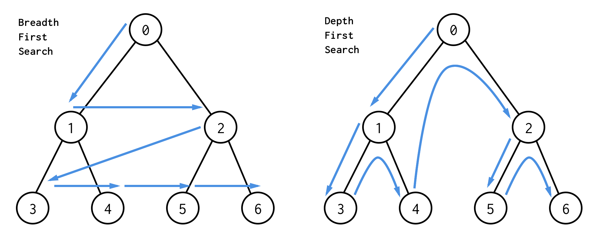

# 너비 우선 탐색(Breadth-First Search)

## 1. BFS / DFS
- 대표적인 **그래프 탐색 알고리즘**
    + 너비 우선 탐색(Breadth First Search) : 정점들과 같은 레벨에 있는 노드들(형제 노드들)을 먼저 탐색하는 방식
    + 깊이 우선 탐색(Depth First Search)   : 정점의 자식들을 먼저 탐색하는 방식


|탐색|동작원리|활용 자료구조|
|---|---|---|
|BFS|너비|Queue|
|DFS|깊이|Stack|
    

#### BFS/DFS 예제
- BFS 방식
    + 한 단계씩 내려가면서, 해당 노드와 같은 레벨에 있는 노드들(형제 노드들)을 먼저 순회
- DFS 방식
    + 한 노드의 자식을 타고 끝까지 순회한 후, 다시 돌아와서 다른 형제들의 자식을 타고 내려가며 순회




## 2. 파이썬으로 그래프를 표현하는 방법
- 파이썬에서 제공하는 `딕셔너리`와 `리스트` 자료 구조를 활용해서 그래프 표현 가능

```python
graph = dict()

graph['0'] = ['1','2']
graph['1'] = ['0','3','4']
graph['3'] = ['1']
graph['4'] = ['1']
graph['2'] = ['0','5','6']
graph['5'] = ['2']
graph['6'] = ['2']
```

## 3. BFS 알고리즘 구현
- 자료구조 `Queue` 활용
    + need_visit 큐 & visited 큐, 두 개의 큐를 생성
    
1. 처음 최상단 노드를 꺼내와 need_visit Queue에 추가
2. need_visit Queue에서 한 개를 꺼내오고 visited Queue에 포함되는지 확인
    - 만약 visited Queue에 없을 경우 
        1. visited Queue에 need_visit Queue에서 꺼낸 노드를 추가
        2. need_visit Queue에서 꺼내온 값을 key로 가지는 list를 need_visit Queue에 추가
        3. 다시 2번으로 
    - 만약 visited Queue에 있을 경우 
        + 행위는 끝이 나고 값은 버려짐. 그리고 다시 2번으로 돌아감 
        
```python
def bfs(graph, start_node):
    visited = list()
    need_visit = list()
    
    need_visit.append(start_node)
    while need_visit:
        node = need_visit.pop(0)
        if node not in visited:
            visited.append(node)
            need_visit.extend(graph[node])
    
    return visited
```

## 4. 시간복잡도
- 일반적인 BFS 시간 복잡도
    + 노드 수 : V
    + 간선 수 : E
        * 위 코드에서 while need_visit은 V + E 번 만큼 수행
    + 시간 복잡도 : O(V + E)